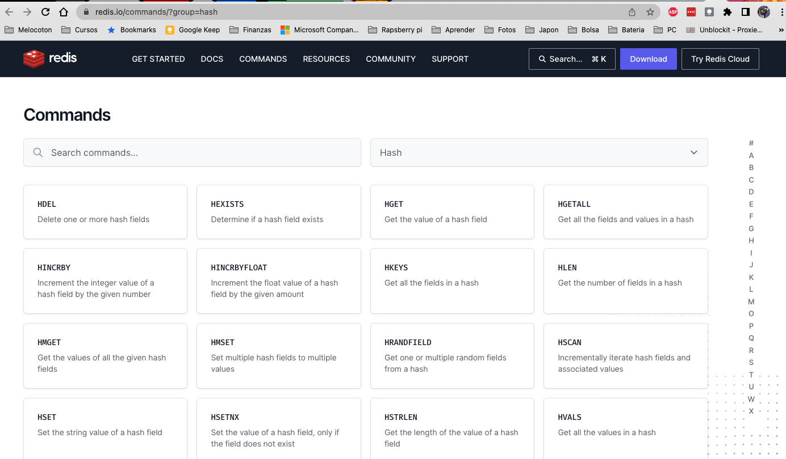

# PFPS - Persistence Layer - Redis 


### What is Redis

[Redis](https://redis.io/) is an open source, in-memory data structure store, used as a database, cache and message broker. <i class="fa-solid fa-book"></i>


Note:
1. a


### Redis4Cats

Is a purely functional and asynchronous Redis client built on top of Cats Effect, Fs2, and Java’s Lettuce.

<p>
  <strong>Redis4Cats</strong> @
  <a href="https://github.com/profunktor/redis4cats"><i class="fa-brands fa-github-square"></i></a>
</p>


Note:
1. a


### Example of Connection

```scala mdoc:invisible
import cats.effect._
import cats.implicits._
import dev.profunktor.redis4cats.Redis
import dev.profunktor.redis4cats.effect.Log.Stdout._
```
```scala mdoc
object QuickStart extends IOApp.Simple {

  def run: IO[Unit] =
    Redis[IO].utf8("redis://localhost").use { redis =>
      for {
        _ <- redis.set("foo", "123")
        x <- redis.get("foo")
        _ <- redis.setNx("foo", "should not happen")
        y <- redis.get("foo")
        _ <- IO(println(x === y)) // true
      } yield ()
    }
}
```
The Redis.apply[F] function requires a Log[F] instance.


### Book connection

- As we have seen several times it uses a Resource to deal with the connection
<!-- .element: class="fragment" data-fragment-index="1" -->

```scala 
val mkRedisResource: Resource[F, RedisCommands[F, String, String]] =
  Redis[F].utf8("redis: //localhost")
```
<!-- .element: class="fragment" data-fragment-index="2" -->

- RedisCommands[F, K, V] allow access to all the available Redis commands
<!-- .element: class="fragment" data-fragment-index="3" -->
- Type-safe: K and V are the types of keys and values. We cannot increment values of type String
<!-- .element: class="fragment" data-fragment-index="4" -->

Note:
1. 


### Redis Commands I




### Redis Commands II

- We will use hashes, which have the format KEY FIELD VALUE. E.g.
- For example: 
``` 
HSET key field value
```
- Sets ` field `  in the hash stored at ` key ` to ` value ` .
- If ` key ` does not exist, a new key holding a hash is created.
- If ` field ` already exists in the hash, it is overwritten.
- Returns the number of fields that were added 


### Redis Commands III

```shell
redis> HSET myhash field1 "Hello"
(integer) 1
redis> HGET myhash field1
"Hello"
redis>
```


### Shopping Cart

```scala
object ShoppingCart {
  def make[F[_]: GenUUID: MonadThrow](
      items: Items[F],
      redis: RedisCommands[F, String, String],
      exp: ShoppingCartExpiration
  ): ShoppingCart[F] = ???
}
```


### Shopping Cart II

```scala
def add(
    userId: UserId,
    itemId: ItemId,
    quantity: Quantity
): F[Unit] =
  redis.hSet(userId.show, itemId.show, quantity.show)  *>
    redis.expire(userId.show, exp.value).void
```

WIP


### Preguntas


### Fuentes

| Título                                                                                                       | Autor          |
|--------------------------------------------------------------------------------------------------------------|----------------|
| [User Guide](https://github.com/typelevel/scalacheck/blob/main/doc/UserGuide.md)                             | Scalacheck     |
| [Redis Command HSET](https://redis.io/commands/hset/)                                                        | Redis          |
| [The lazy programmer's guide to writing thousands of tests](https://www.youtube.com/watch?v=IYzDFHx6QPY)     | Scott Wlaschin |
| [Property-Based Testing: Let Your Testing Library Work for You](https://www.youtube.com/watch?v=pO4_3kg1wMw) | Magda Stożek   |


### Fuentes

| Título                                                                                                            | Autor          |
|-------------------------------------------------------------------------------------------------------------------|----------------|
| [Property (mathematics)](https://en.wikipedia.org/wiki/Property_(mathematics))                                    | Wikipedia      |
| [Refactoring the three laws of TDD](http://www.javiersaldana.com/articles/tech/refactoring-the-three-laws-of-tdd) | Javier Saldana |