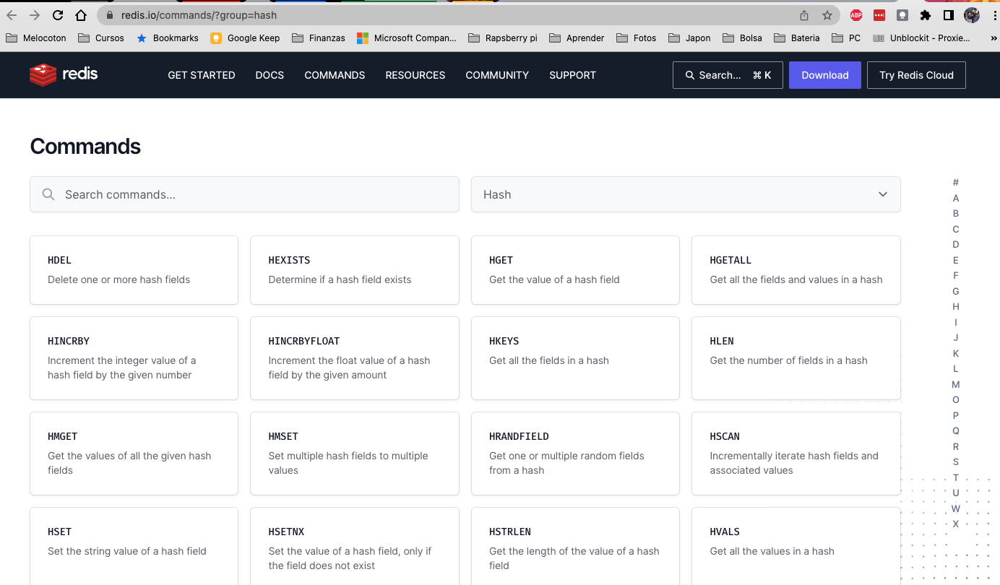

# PFPS - Persistence Layer - Redis 


### What is Redis

[Redis](https://redis.io/) is an open source, in-memory data structure store, used as a database, cache and message broker. <i class="fa-solid fa-book"></i>


### Redis4Cats

Is a purely functional and asynchronous Redis client built on top of Cats Effect, Fs2, and Java’s Lettuce.

<p>
  <strong>Redis4Cats</strong> @
  <a href="https://github.com/profunktor/redis4cats"><i class="fa-brands fa-github-square"></i></a>
</p>


### Example of Connection


```scala
object QuickStart extends IOApp.Simple {

  def run: IO[Unit] =
    Redis[IO].utf8("redis://localhost").use { redis =>
      for {
        _ <- redis.set("foo", "123")
        x <- redis.get("foo")
        _ <- redis.setNx("foo", "should not happen")
        y <- redis.get("foo")
        _ <- IO(println(x === y)) // true
      } yield ()
    }
}
```

Note:
1. Here we can see an example from the README of the library where we easy store and retrieve data
2. The Redis.apply[F] function requires a Log[F] instance.


### Book connection

```scala
val mkRedisResource: Resource[F, RedisCommands[F, String, String]] =
  Redis[F].utf8("redis: //localhost")
```

RedisCommands[F, K, V] allow access to all the available Redis commands

Note:
1. As we have seen several times it uses a Resource to deal with the connection 
2. This RedisCommand is Type-safe: because K and V are the types of keys and values. 
3. For example, we cannot increment values of type String


### Redis Commands I


[Redis Hash commands](https://redis.io/commands/?group=hash)


Note: 
1. Here we can see all the Hashes Redis commands 
2. The Hashes is the Redis data type selected in this book for this requirement 
3. Because it allows to store field-value pairs 
4. So we can store for an user_id different fields and retrieve them
5. But there are different types of data types: Lists, String, Keys


### Redis Commands II

```shell
> hset user:1000 username antirez birthyear 1977 verified 1
(integer) 3
> hget user:1000 username
"antirez"
> hget user:1000 birthyear
"1977"
> hgetall user:1000
1) "username"
2) "antirez"
3) "birthyear"
4) "1977"
5) "verified"
6) "1"
```

Note:
1. For example here with hset we set different  `fields` username, birthday, verified  in the hash stored at `key` user:1000. 
2. If `key` does not exist, a new key holding a hash is created. 
3. If `field` already exists in the hash, it is overwritten. 
4. When we set we can see that the it returns the number of fields that were added


### Shopping Cart
Going back again to the book:
```scala
object ShoppingCart {
  def make[F[_]: GenUUID: MonadThrow](
      items: Items[F],
      redis: RedisCommands[F, String, String],
      exp: ShoppingCartExpiration
  ): ShoppingCart[F] = ???
}
```

Note:
1. Let’s first have a look at the dependencies of the ShoppingCart interpreter 
2. In addition to RedisCommands, it takes 
3. an Items[F] and a 
4. ShoppingCartExpiration (a newtype over a FiniteDuration).


### Shopping Cart - add

```scala
def add(
    userId: UserId,
    itemId: ItemId,
    quantity: Quantity
): F[Unit] =
  redis.hSet(userId.show, itemId.show, quantity.show)  *>
    redis.expire(userId.show, exp.value).void
```

Note:
1. Adds an item id (field) and a quantity (value) to the user id key 
2. Also sets the expiration time of the shopping cart for the user


### Shopping Cart - GET

```scala
def get(userId: UserId): F[CartTotal] =
  redis.hGetAll(userId.show).flatMap {
    _.toList
      .traverseFilter {
        case (k, v)  =>
          for {
            id <- ID.read[F, ItemId](k)
            qt <- MonadThrow[F].catchNonFatal(Quantity(v.toInt))
            rs <- items.findById(id).map(_.map(_.cart(qt)))
        } yield rs 
      }
      .map { items  =>
        CartTotal(items, items.foldMap(_.subTotal))
      } 
  }

```
Note:
1. It tries to find the shopping cart for the user via the hGetAll function, 
2. This returns a Map[String, String], or a Map[K, V], generically speaking. 
3. If it exists, it parses both fields and values into a List[CartItem] and finally, 
4. it calculates the total amount.


### Shopping Cart - Cart Item
```scala
@derive(decoder, encoder, eqv, show)
case class CartItem(
                     item: Item,
                     quantity: Quantity ){
  def subTotal: Money = USD(item.price.amount * quantity.value)
}

implicit val moneyMonoid: Monoid[Money] =
  new Monoid[Money] {
    def empty: Money = USD(0)
    def combine(
                 x: Money,
                 y: Money
               ): Money = x + y
  }
```

Note:
1. The subTotal function is defined on CartItem we are going to see in the following slide
2. The foldMap function on List[Item] requires a Monoid[Money] instance


### Shopping Cart - delete, removeItem
```scala
def delete(userId: UserId): F[Unit] =
  redis.del(userId.show).void

def removeItem(userId: UserId, itemId: ItemId): F[Unit] =
  redis.hDel(userId.show, itemId.show).void
```

Note:
1. delete, which simply deletes the shopping cart for the user.
2. removeItem, which removes a specific item from the shopping cart.
3. Note here it uses `hdel` which Removes the specified fields from the hash stored at key


### Shopping Cart - update
```scala
def update(userId: UserId, cart: Cart): F[Unit] =
  redis.hGetAll(userId.show).flatMap {
    _.toList.traverse_ {
      case (k, _)  =>
        ID.read[F, ItemId](k).flatMap { id  =>
          cart.items.get(id).traverse_ { q  =>
            redis.hSet(userId.show, k, q.show)
          }
        } }*>
      redis.expire(userId.show, exp.value).void
  }
```

Note:
1. update retrieves the shopping cart for the user (if it exists)
2. and it updates the quantity of each matching item,
3. followed by updating the shopping cart expiration.


### Health Check
```scala
object HealthCheck {
  def make[F[_]: Temporal](
      postgres: Resource[F, Session[F]],
      redis: RedisCommands[F, String, String]
  ): HealthCheck[F] =
    new HealthCheck[F] {
      val q: Query[Void, Int] =
        sql"SELECT pid FROM pg_stat_activity".query(int4)
      val redisHealth: F[RedisStatus] =
        redis.ping
          .map(_.nonEmpty)
          .timeout(1.second)
          .map(Status._Bool.reverseGet)
          .orElse(Status.Unreachable.pure[F].widen)
          .map(RedisStatus.apply)
      val postgresHealth: F[PostgresStatus] =
        postgres
          .use(_.execute(q))
          .map(_.nonEmpty)
          .timeout(1.second)
          .map(Status._Bool.reverseGet)
          .orElse(Status.Unreachable.pure[F].widen)
          .map(PostgresStatus.apply)
      val status: F[AppStatus] =
        (
          redisHealth,
          postgresHealth
        ).parMapN(AppStatus.apply)
 } 
}
```
Note:
1. To make sure the persistance layer is working correclty there is an endpoint called "/healthcheck"
2. For Redis, we simply ping the server; 
3. for Postgres, we run a simple query. 
3. Both actions have a timeout of one second 
5. Are performed in parallel, using the parMapN function.


### Blocking
- Skunk & Redis4Cats are both async, so don't need to worry about blocking operations
- But in other libraries such as Slick which are blocking, you can use:
- In Cats Effects 2 we have `Blocker`
- In Cats Effects 3 we have the following functions :

```scala
// for all `Sync[F]`
def blocking[A](thunk: => A): F[A] 

// for all `Async[F]`
def evalOn[A](fa: F[A], ec: ExecutionContext): F[A]
```

Note:
1. `Blocker`  is datatype that merely wraps an ExecutionContext
2. `evalOn` is when need to run a whole effect on a blocking pool


### Blocking II 

```scala
import cats.effect.IO
import cats.effect.Sync

val program = IO.blocking(println("hello blocking!"))
// program: IO[Unit] = Blocking(
//   hint = Blocking,
//   thunk = <function0>,
//   event = cats.effect.tracing.TracingEvent$StackTrace
// )

```
```scala
import scala.concurrent.ExecutionContext

def myBlockingPool: ExecutionContext = ???

def myBlocking[A](fa: IO[A]) = fa.evalOn(myBlockingPool)
```


### Transactions
- Imagine we want to create an:
  - Item
  - Brand
  - Categories
- In an atomic transaction
- As they are right now defined we cant, so the book propose some changes


  
### Transactions II

````scala
trait TxItems[F[_]] {
  def create(item: ItemCreation): F[ItemId]
}

case class ItemCreation(
  brand: BrandName,
  category: CategoryName,
  name: ItemName,
  desc: ItemDescription,
  price: Money
)
````
Note:
1. Instead of taking the BrandId and CategoryId, it takes the names, 
2. the IDs will be created in the transactional block.


### Transaction III 
````scala
object TxItems {
  import BrandSQL._, CategorySQL._, ItemSQL._
  def make[F[_]: GenUUID: MonadCancelThrow](
      postgres: Resource[F, Session[F]]
  ): TxItems[F] =
    new TxItems[F] {
      def create(item: ItemCreation): F[ItemId] =
        postgres.use { s  =>
          (
            s.prepare(insertBrand),
            s.prepare(insertCategory),
            s.prepare(insertItem)
          ).tupled.use {
            case (ib, ic, it)  =>
              s.transaction.surround {
                for {
                  bid <- ID.make[F, BrandId]
                  _   <- ib.execute(Brand(bid, item.brand)).void
                  cid <- ID.make[F, CategoryId]
                  _   <- ic.execute(Category(cid, item.category)).void
                  tid <- ID.make[F, ItemId]
                  itm = CreateItem(item.name, item.desc, item.price, bid, cid)
                  _   <- it.execute(tid ~ itm).void
                } yield tid 
              }
          } 
        }
    } 
}
````
Note:
- we only need to execute the SQL statements within the scope of the transaction
- `s.transaction.surround`
- In Doobie we can do this with ConnectionIO


### Transaction Doobie I

````scala
trait UserRepository[F[_]] {
  def findUser(id: SlackUserId): F[Option[UserId]]
}

object UserRepository {
  import UserQueries._
  val repo: UserRepository[ConnectionIO] = new UserRepository[ConnectionIO] {
    override def findUser(id: SlackUserId): ConnectionIO[Option[UserId]] =
      userIdQuery(id).option
  }
}

object UserQueries {

  def userIdQuery(id: SlackUserId): Query0[UserId] =
    sql"select user_id from users where slack_user_id = $id".query[UserId]

}
````


### Transaction Doobie II
````scala
trait SubscriptionRepository[F[_]] {
  def getSubscriptions(userId: UserId): F[List[Subscription]]
}

object SubscriptionRepository {
  import SubscriptionQueries._
  val repo: SubscriptionRepository[ConnectionIO] = new SubscriptionRepository[ConnectionIO] {
    override def getSubscriptions(userId: UserId): ConnectionIO[List[Subscription]] =
      getSubscriptionsQuery(userId).to[List]
  }
}

object SubscriptionQueries {
  def getSubscriptionsQuery(userId: UserId): Query0[Subscription] =
    sql"""
         select owner, repository, subscribed_at, deleted_at
         from subscriptions
         where user_id =$userId
         """.query[Subscription]
}
````


### Transaction Doobie III
`````scala
trait UserSubscriptionRepository[F[_]] {

  def getSubscription(slackUserId: SlackUserId): F[List[Subscription]]

}

object UserSubscriptionRepository {
  val impl: UserSubscriptionRepository[ConnectionIO] = new UserSubscriptionRepository[ConnectionIO] {
    override def getSubscription(slackUserId: SlackUserId): ConnectionIO[List[Subscription]] =
      OptionT(UserRepository.repo.findUser(slackUserId))
        .semiflatMap(userId => SubscriptionRepository.repo.getSubscriptions(userId))
        .getOrRaise(UserIdNotFoundError)
  }
`````


### Questions?


### Fuentes

| Título                                                                                | Autor         |
|---------------------------------------------------------------------------------------|---------------|
| [Redis Data Types](https://redis.io/docs/data-types/tutorial/#hashes)                 | Redis         |
| [Redis Command HSET](https://redis.io/commands/hset/)                                 | Redis         |
| [Cats Effect Migration Guide](https://typelevel.org/cats-effect/docs/migration-guide) | Cats Effect   |
| [Practical FP in Scala](https://leanpub.com/pfp-scala)                                | Gabriel Volpe |